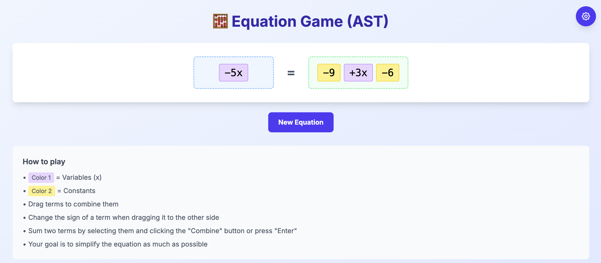

# Move2Solve - Interactive Algebra Learning Tool
An interactive web application designed to help high school students visualize and understand algebraic equation solving through drag-and-drop manipulation. Students can move terms between equation sides, combine like terms, and see real-time visual feedback of their algebraic operations.

## 🎮 Preview

## Key Goals
- **Drag & Drop Interface**
- **Term Combination**
- **Customizable Difficulty**
- **Real-time Validation**

## Project Status

### ✅ Completed Features
- Drag & Drop Interface, only for sum and subs
- Selecting two similar terms
- Enter and show result, only for two terms

### 🚧 Upcoming features

#### High Priority (For proper functional site)

- Multiplication & Division operands
- Multiplication & Division rule
- Better selection and enter panel
- Proper win condition
- Undo moves

#### Next Priority

- Improve UI
- Steps visualization
- Tutorial sistem
- Improve hints and rules

## 📌 Code Comment Flags
| Tag        | Meaning                          |
|------------|----------------------------------|
| `// TODO`  | Work pending                     |
| `// FIXME` | Bug to fix                       |
| `// HACK`  | Quick fix / workaround           |
| `// NOTE`  | Important info for maintainers   |
| `// REVIEW`| Needs review                     |
| `// DEPRECATED` | Legacy code, avoid using    |

